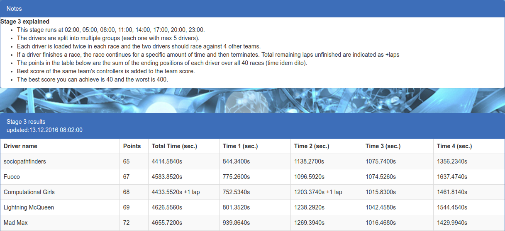

# Computational Intelligence

## Description

Code for the final project of the [Computational Intelligence](http://gss.uva.nl/content/masters/artificial-intelligence/study-programme/computational-intelligence.html) course at the University of Amsterdam.

We apply methods from different paradigms of Computational Intelligence to develop controllers for virtual car racing on The Open Racing Car Platform <a href="http://torcs.sourceforge.net/">TORCS</a>. State-of-the-art controllers employ a variety of techniques ranging from optimizing physics-based heuristics using evolutionary algorithms, to training multi-layer perceptrons to imitate existing controllers. We propose a novel method based on swarm communication and describe our controller in our <a href="./documents/report.pdf">report</a>. 

Our controller achieved the 1st position in the 40-race general competition (on many different tracks) and the 4th position in the final tournament at the Computational Intelligence course in December 2016.

  <i> Ranked 1st - sociopathfinders </i>

## Documents
- [Paper](./documents/report.pdf)
- [Presentation](./documents/presentation.pdf)
- [Assignment](./documents/Assignment.pdf)

## Installation and Testing
See the [installation guidelines](./documents/installation_guides/).

## Dependencies
- Python 3.x: Scipy
- Java Runtime
- TORCS installation, see [guidelines](./documents/installation_guides/)

## Contributors
- [Dana Kianfar](https://github.com/danakianfar) 
- [Jose Gallego](https://github.com/jgalle29)
- [Jonas Koehler](https://github.com/jonas-koehler)

## Copyright

Copyright © 2016 Dana Kianfar, Jose Gallego and Jonas Koehler.

This project is distributed under the <a href="LICENSE">MIT license</a>. Please follow the <a href="http://student.uva.nl/en/az/content/plagiarism-and-fraud/plagiarism-and-fraud.html">UvA regulations governing Fraud and Plagiarism</a> in case you are a student.

